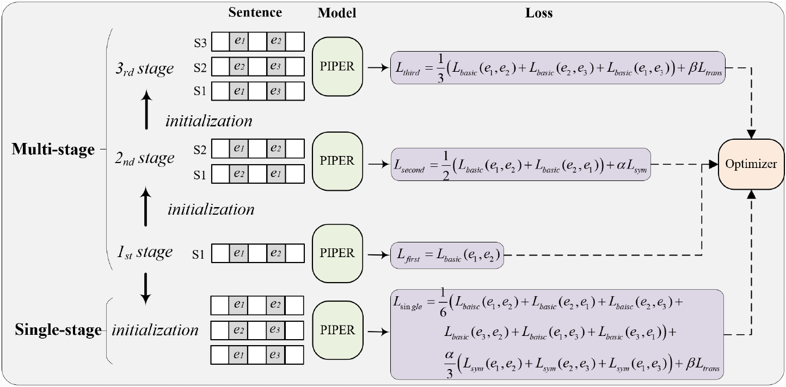

# PIPER: A Logic-driven Deep Contrastive Optimization Pipeline for  Event Temporal Reasoning

## 1. Environment

### 1.1 Hardware platform 

CPU: 12 vCPU Intel(R) Xeon(R) Platinum 8255C CPU @ 2.50GHz

GPU: RTX 3090(24GB) * 1

1.2 Python Environment

python: Python 3.8.10 (default, Jun  4 2021, 15:09:15)  

pytorch: torch  1.10.0+cu113

transformers: transformers 3.0.1

## 2 Execution (Taking TB-Dense as an example)

### 2.1 standard execution

#### 2.1.1 multi-stage: 

`STEP-1: cd PIPER-Logic`

`STEP-2 (First-stage): python main.py --stage backbone --task_name TB-Dense --hard False --gpu_id: 0`

`STEP-3 (Second-stage): python main.py --stage symmetry --task_name TB-Dense --hard False --gpu_id: 0`

`STEP-4 (Second-stage): python main.py --stage transitivity --task_name TB-Dense --hard True --gpu_id: 0`

#### 2.1.2 single-stage:

`STEP-1: cd PIPER-Logic`

`STEP-2 (First-stage): python main.py --stage backbone --task_name TB-Dense --hard False --gpu_id: 0`

`STEP-3 (Single-stage): python main.py --stage sym+trains --task_name TB-Dense --hard True --gpu_id: 0`

### 2.2 extended execution (parts of RL-based pre-research mentioned in Conclusion)

`STEP-1: cd PIPER-Logic`

`STEP-2 (First-stage): python main.py --stage backbone --task_name TB-Dense --hard False --gpu_id: 0`

`STEP-2 (Second-stage): python main.py --stage symmetry --task_name TB-Dense --hard False --gpu_id: 0`

Note: Because the RL needs Monte Carlo sampling with many rounds, the time of running is too long ~~~